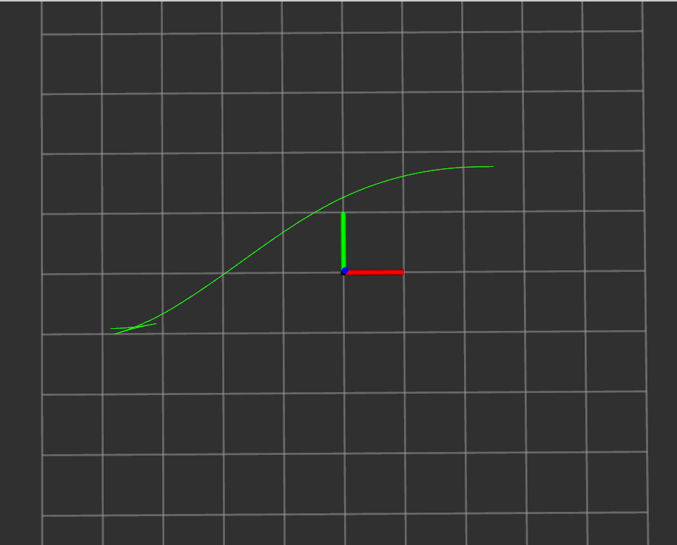

#apa_planner

## how to run
```
roslaunch apa_planner run.launch
```

if you want to get some information from the planner node, you can only run the planner node in a terminal window
```
# terminal01
roslaunch apa_planner run_planner_node.launch
# terminal02
roslaunch apa_planner run_rviz.launch
```



